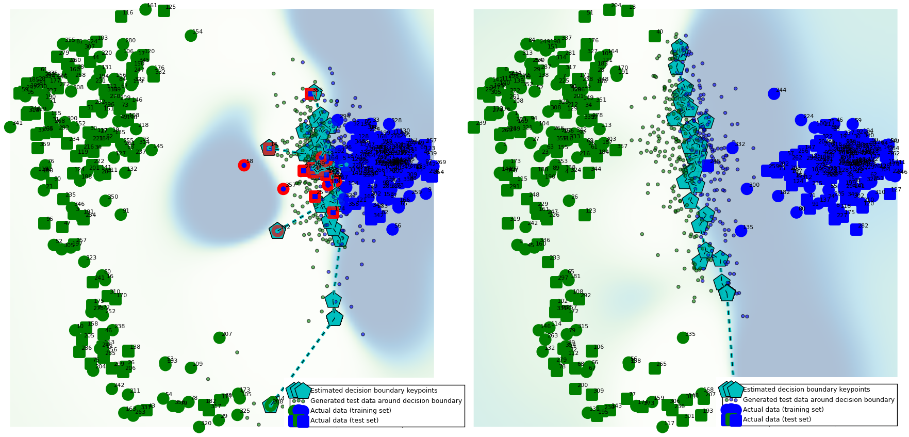
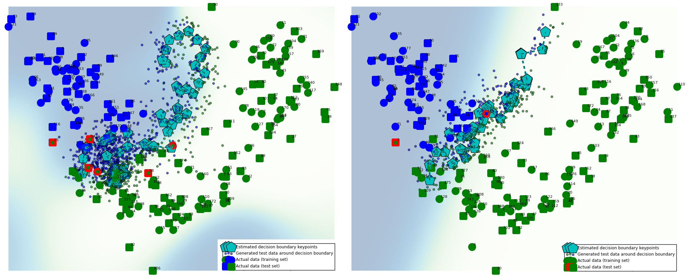

# Plotting high-dimensional decision boundaries

[](https://www.python.org/)
[](https://lbesson.mit-license.org/)

[](https://github.com/python/black)

An experimental, scikit-learn compatible approach to **plot high-dimensional decision boundaries**. This facilitates **intuitive understanding**, and helps improve models by allowing the **visual inspection** of misclassified regions, model complexity, and the amount of overfitting/underfitting (augmenting more reliable but less intuitive tools such as training/test error curves and ROC curves); as well as of individual data points and their contribution to the decision surface. Finally, it shows which regions are likely to be misclassified, which are uncertain, and (in applications were active querying is possible) the proximity of which instances should be queried. 

The usual approach of classifying each vertex of a 2D grid to visualize decision boundaries (see e.g. the [Iris SVM example](http://scikit-learn.org/stable/auto_examples/svm/plot_iris.html)) in two dimensions breaks down when the dimensionality is higher. Although it would in principle be possible to construct a high-dimensional grid and project it down to 2D, this is intractable in practice, since the number of grid vertices to be classified grows exponentially with the number of dimensions.

Instead, the present method samples from regions in which the given classifier is maximally uncertain (close to 0.5 prediction probability), which are near the decision surface by definition. Subsequently, it projects the decision surface samples (keypoints) into 2D for visualization, and generates and classifies some test points around the estimated decision boundary for validation (see Usage section below).

**Example use case**: visualizing the **effect of regularization parameters**. Left: weakly regularized logistic regression (`C=1e-9`). Higher decision boundary complexity (noisy positions of cyan keypoints), more testing error (red markers). Right: regularized logistic regression (`C=10`). Lower complexity, no testing error. Data: sklearn toy digits (64 dimensions).

*(Green and blue markers: data points, round markers: training data, square markers: testing data; red highlights: misclassified data points; cyan pentagons: decision boundary keypoints [at which the classifier predicts 0.5 probability])*

**Example use case**: visualizing **overfitting** and **underfitting**. Left: k-nearest neighbor with k=2 neighbors. Overfits: data points misclassified (highlighted in red) due to useless 'squiggles'. Right: over-regularized support vector machine (`C=1`, `gamma=0.07`). Misses the data point on the left (marked in red) due to underfitting. Data: UCI wine dataset (13 dimensions).


## Usage


The project requires [scikit-learn](http://scikit-learn.org/stable/install.html), [matplotlib](http://matplotlib.org/users/installing.html) and [NLopt](http://ab-initio.mit.edu/wiki/index.php/NLopt_Installation) to run.

Usage example:

```python
digits = load_digits(n_class = 2) # data
model = KNeighborsClassifier(n_neighbors=10) # classifier able to produce probabilities

db = DBPlot(model, PCA(n_components=2))
db.fit(digits.data, digits.target)
db.plot().show() # use db.plot(generate_testpoints=False).show() to speed up plotting by skipping testpoint generation
# decision_boundary_points_2d, testpoints_2d, y_testpoints, background = db.generate_plot() # for custom plotting and analysis
```

## Functionality & Reliability


Note: **this is an early stage research project, and work in progress** (it is by no means efficient or well tested)!

The core idea is using **black-box optimization to find keypoints on the decision hypersurface** (those points in high-dimensional space for which prediction probability is very close to 0.5) which lie between the two classes in the 2D plot, and **projecting them to 2D** to estimate the location of the decision boundary. 


The `DBPlot` object takes a **classifier** (the decision surface of which is to be estimated) and, optionally, a **dimensionality reduction method** (which defaults to `PCA`) as inputs. Most classifiers exposing `predict_proba` and `predict` methods should work, as long as it is possible for them to reach close to 0.5 prediction probability (note that this is not the case for e.g. 1-NN or a random forests with 3 trees! In these cases, the optimization will not converge). 

In terms of dimensionality reduction methods, the current version supports all [matrix decomposition](http://scikit-learn.org/stable/modules/classes.html#module-sklearn.decomposition) variants (including [PCA](http://scikit-learn.org/stable/modules/generated/sklearn.decomposition.PCA.html#sklearn.decomposition.PCA), [Kernel PCA](http://scikit-learn.org/stable/modules/generated/sklearn.decomposition.KernelPCA.html#sklearn.decomposition.KernelPCA), [NMF](http://scikit-learn.org/stable/modules/generated/sklearn.decomposition.NMF.html#sklearn.decomposition.NMF) etc.), as well as [Isomap](http://scikit-learn.org/stable/modules/generated/sklearn.manifold.Isomap.html#sklearn.manifold.Isomap) embeddings for non-linear dimensionality reduction preserving global topology, and any other method that has an implemented and exposed `transform(X)` function. This can include supervised dimensionality reduction, such as [LDA](http://scikit-learn.org/0.16/modules/generated/sklearn.lda.LDA.html) (with `solver='eigen'`), which projects to the most discriminative axes.

Choosing a **dimensionality reduction method resulting in acceptabe class separation** is crucial for achieving interpretable results.  

When inspecting graphs and improving your classifier, you can trust
- The actual data points (large green and blue points)
- Misclassification feedback (red circles around the data points)
- Generated test data points colored according to your classifier predictions (tiny, faint green and blue points)

Everything else is a rough estimate intended for facilitating intuition, rather than precision; and needs to be traded off against runtime (set `generate_testpoints=False`, or decrease `n_decision_boundary_keypoints`, to decrease runtime).  
- The decision boundary keypoints (large cyan squares) are guaranteed to lie very close to the decision boundary (depending on the `acceptance_threshold` parameter setting). With very small tolerance, these are fairly reliable, but do NOT provide the full picture (a complete, reliable decision boundary could only be plotted with an infinite number of keypoints). To increase reliability, decrease `acceptance_threshold` or increase the number of decision boundary keypoints
- The background shading reflects rough probability scores around the decision boundary, estimated from the generated test data points (its accuracy will depend on the number and coverage of these generated data points). As above, it is NOT a full picture (the generated data points do not provide full coverage, and only cover the space between the two classes, not beyond). To increase reliability, increase `n_generated_testpoints_per_keypoint` (or tweak the internal SVC approximating them in order to render the shading, e.g. by enabling `tune_background_model=True` for the plot)

All plotted information is subject to the limitations inherent in forcing high-dimensional data into a low-dimensional plot.

## Installation
Clone the repo, navigate to the repo directory and run the follwing two commands:
```
pip install -r requirements
```
```
conda install -c conda-forge nlopt 
```
